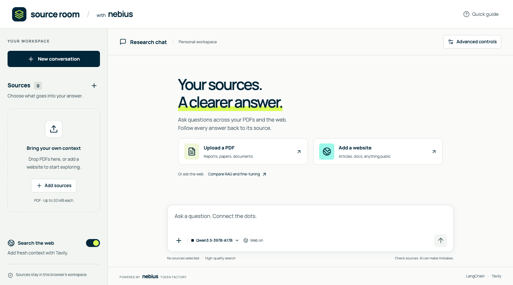
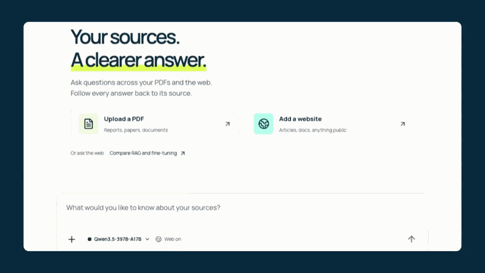
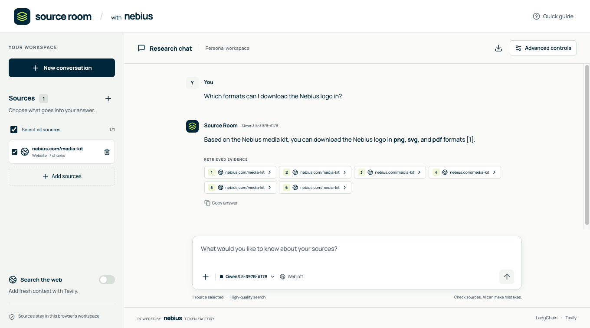
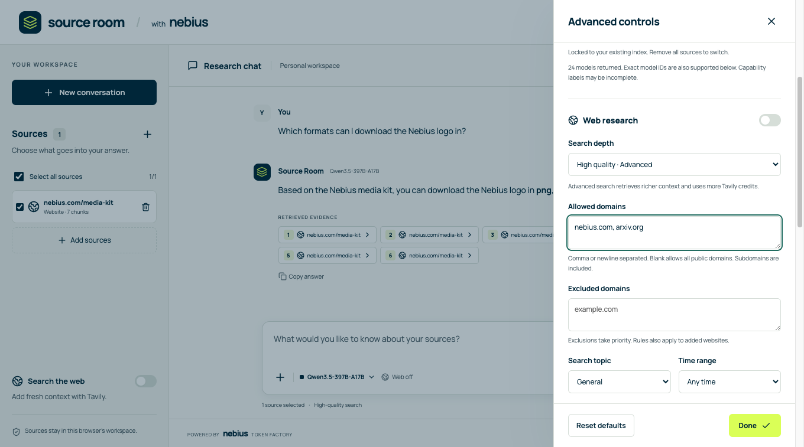
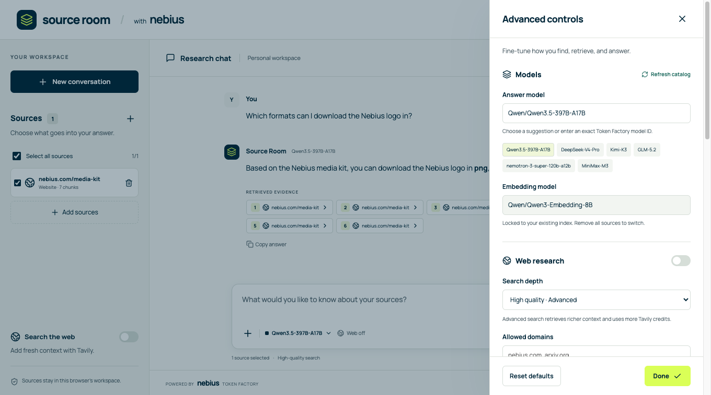
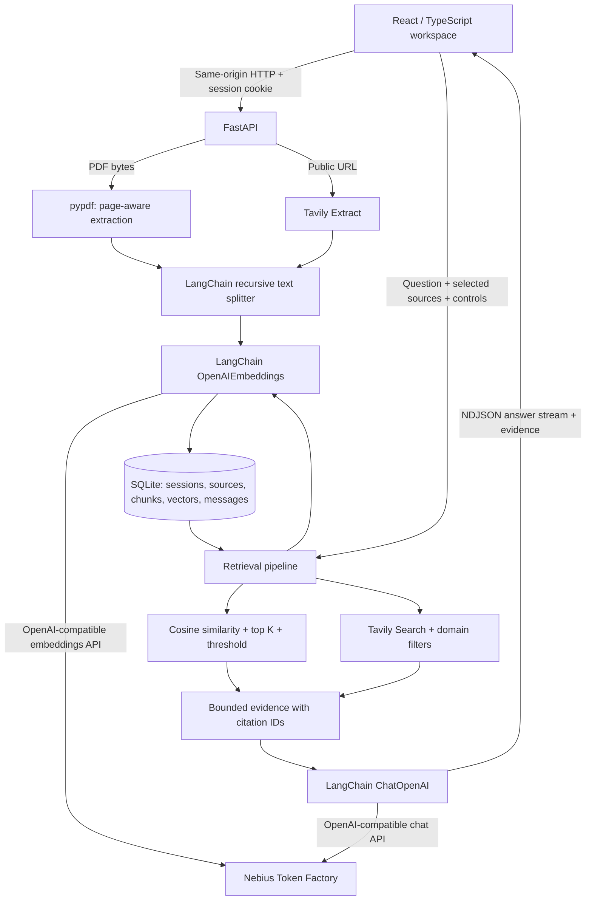

# Source Room

A focused chat workspace for PDFs, websites, and live web research. Built with **LangChain, Tavily, and Nebius Token Factory**, with a React interface inspired by Nebius’s navy, lime, and mint palette.



## Watch it work

These recordings show the running app using real Nebius and Tavily APIs with public Nebius media-kit content.

[](docs/media/website-chat.mp4)

| Demo | What you will see | Video |
| --- | --- | --- |
| Website chat · 23 seconds | Ask about an indexed website, receive a streamed answer, and inspect its evidence | [Watch / download MP4](docs/media/website-chat.mp4) |
| Advanced controls · 17 seconds | Refresh available models, set allowed domains, and inspect retrieval and generation settings | [Watch / download MP4](docs/media/advanced-controls.mp4) |

<details>
<summary>More screenshots: live answer and domain controls</summary>





</details>

The GIF plays inline; the MP4 links open the repository video files. Full-resolution screenshots and recording details are in [docs/media](docs/media/README.md).

## What it does

- Upload multiple text-based PDFs, extract text by page, and retrieve relevant passages with Nebius embeddings.
- Add individual website URLs using Tavily Extract, then chat across selected PDFs and pages.
- Optionally search the live web on each question with Tavily Search.
- Stream Markdown answers with numbered citations and inspectable evidence excerpts, PDF page numbers, and original web links.
- Select a Nebius answer model independently from the embedding model. Refresh the account’s model catalog or enter exact IDs.
- Control allowed/excluded domains, search quality, extraction depth, recency, topic, retrieval, chunking, and generation.
- Persist source text, vectors, and the last 100 chat messages in a browser-scoped SQLite workspace. Start a new conversation without deleting sources; export the conversation as Markdown.
- Run a single local process after building the frontend, or deploy one Docker service to Railway or Render with a persistent volume.

This is a working application, not a simulated chat. It opens without credentials and explains setup; inference and ingestion require real provider keys. No sample answers are returned in the application.

## Run locally

Requires **Python 3.12+, uv, and Node.js 22+**. Install [uv](https://docs.astral.sh/uv/getting-started/installation/) if needed.

```bash
cp .env.example .env
```

Edit `.env` and add:

```dotenv
NEBIUS_API_KEY=your-nebius-key
TAVILY_API_KEY=your-tavily-key
```

Create keys in [Nebius Token Factory](https://tokenfactory.nebius.com/) and [Tavily](https://app.tavily.com/). Then run:

```bash
./scripts/start-local.sh
```

Open **http://127.0.0.1:8000**. The script installs locked dependencies, builds the interface, and starts FastAPI. It creates `.env` from the example if missing; you can explore the UI before adding keys. Restart the server after changing environment variables.

For PDF-only use, a Nebius key is sufficient: turn **Search the web** off. Tavily is required for website ingestion and live search.

### Development with hot reload

```bash
uv sync --frozen
npm ci
```

Run in two terminals:

```bash
uv run uvicorn backend.main:app --reload --host 127.0.0.1 --port 8000
```

```bash
npm run dev
```

Open the Vite URL printed in the terminal (normally http://127.0.0.1:5173). Vite proxies `/api` to FastAPI, so the browser uses one origin and API credentials stay on the server.

### Docker locally

After filling `.env`:

```bash
docker compose up --build
```

Open http://127.0.0.1:8000. Compose binds only to localhost and stores SQLite in the `source-room-data` named volume. `docker compose down` preserves it; `docker compose down -v` deletes the stored workspaces.

## Models

The default answer model is `Qwen/Qwen3.5-397B-A17B`. Suggested alternatives include DeepSeek V4 Pro, Kimi K3, GLM-5.2, NVIDIA Nemotron 3 Super, and MiniMax M3. These answer suggestions were taken from the [official Nebius model cookbook](https://github.com/nebius/token-factory-cookbook/blob/main/models/README.md).

`Qwen/Qwen3-Embedding-8B` is the default embedding model, verified against the authenticated catalog and live embeddings API on September 13, 2026. Availability can change: use **Advanced controls → Refresh catalog** to confirm access before indexing. Set `DEFAULT_CHAT_MODEL` and `DEFAULT_EMBEDDING_MODEL` to customize initial defaults.

The catalog endpoint requests authenticated `GET /v1/models`. Some catalog records lack capability metadata: the UI uses type/name heuristics to separate chat and embeddings, and retains editable exact IDs. If a model is missing or rejects parameters, use an available model’s exact ID from [Nebius endpoints](https://tokenfactory.nebius.com/endpoints). It never silently substitutes a different model or provider.

The embedding model is locked once a workspace has sources. Remove all sources and re-add them to switch models. This prevents dimension mismatches and comparisons between unrelated embedding spaces. Changing the answer model does not require reindexing. Fast/base flavors and context windows are model-specific; only use a `-fast` ID when your catalog lists it.

## Advanced controls



| Control | Default | Behavior |
| --- | --- | --- |
| Answer model | Qwen3.5-397B-A17B | Nebius chat generation through LangChain |
| Embedding model | Qwen3 Embedding 8B | Nebius embeddings for ingestion and query retrieval |
| Search the web | On | Adds Tavily evidence to the selected document context |
| Search depth | Advanced | High-quality search; basic uses less Tavily search credit |
| Allowed domains | Empty | Limits web search, ingestion, and retrieval of saved websites; includes subdomains |
| Excluded domains | Empty | Takes precedence over the allowlist |
| Search results | 5 | 1–10 results requested from Tavily |
| Topic | General | General, news, or finance |
| Time range | Any time | Day, week, month, year, or unrestricted |
| Extraction depth | Advanced | Used when adding a website; existing pages are not automatically refreshed |
| Retrieved chunks | 6 | Top 1–20 local passages, before the context budget |
| Minimum similarity | 0 | Cosine cutoff from -1 to 1; high thresholds can yield no evidence |
| Chunk size / overlap | 1,200 / 200 chars | Applies to new sources; overlap must be smaller than the chunk |
| Evidence budget | 24,000 chars | Bounds source text in the prompt; 4,000–60,000 |
| Temperature / top P | 0.2 / 0.95 | Generation sampling; model support varies |
| Output limit | 2,048 tokens | 256–8,192; reasoning models may consume the budget before answering |
| Previous questions | 4 | Retains up to 10 prior user questions for follow-up context |
| Answer style | Balanced | Concise, balanced, or detailed |

Domain fields accept bare domains separated by commas, whitespace, or newlines. `example.com` matches `docs.example.com`, but never `example.com.evil.org`. Private/local hostnames, literal IP addresses, URL credentials, and nonstandard ports are rejected. Excluded domains take priority. Domain filters do not apply to uploaded PDFs. They are application filters, not a guarantee about Tavily’s internal fetching or redirects.

Preferences are saved in the browser’s local storage. Invalid parameter combinations are rejected by server-side Pydantic validation, with a visible error.

## Architecture



### Ingestion

1. FastAPI identifies the browser using an opaque, HttpOnly, SameSite session cookie. An optional shared password protects all paid API operations.
2. PDFs are checked for file signature, size, encryption, page count, and extractable text. Page numbers are 1-based. Website URLs are validated and passed to Tavily Extract; the application does not fetch arbitrary URLs directly.
3. LangChain’s `RecursiveCharacterTextSplitter` produces overlapping chunks. `OpenAIEmbeddings` points to Nebius’s base URL with `check_embedding_ctx_length=False`, ensuring text strings—not OpenAI-specific tokenizer IDs—are sent to Nebius.
4. Embeddings and chunks are committed together in SQLite. Raw uploaded PDFs are not retained; extracted text and vectors are. Failed ingestion does not leave a partial index.

### Retrieval and answering

1. Validate selected source ownership and ensure the requested embedding model matches the index. Reapply current domain restrictions to saved websites.
2. Build a retrieval query using the current question and recent user questions. Embed it and rank local passages by cosine similarity using NumPy. Only the configured top K above the threshold are candidates.
3. If enabled, query Tavily with explicit depth, result count, topic, recency, include/exclude domains, and raw text. Filter returned URLs again. If Tavily fails but local evidence exists, continue with a visible warning; otherwise show the failure.
4. Interleave local and web candidates so one cannot consume the entire context budget first. Limit each passage to 6,000 characters, cap the combined text, and assign stable `[1]`, `[2]`, … evidence IDs for that answer.
5. LangChain `ChatOpenAI` calls Nebius’s `/chat/completions` endpoint. The prompt treats all source content as untrusted evidence, requests grounded answers, and instructs the model to admit insufficient evidence. No tools, shell execution, or autonomous browsing are exposed to the answering model.
6. Stream newline-delimited JSON: `status`, `sources`, `token`, and `done`; failures emit `error`. The UI consumes the stream incrementally and can cancel it.
7. Save a complete user/assistant pair only after successful generation. Interrupted and failed partial answers remain visibly marked in the current UI and are not added to server history.

Only previous **user questions** are carried into the generation prompt. Old assistant answers might cite deleted or deselected sources, so they are excluded. Follow-ups to your questions work; requests that depend on exact wording of an earlier answer may need that wording included again. There is no separate query-rewrite model, reranker, OCR model, vision pipeline, or autonomous multi-step research agent.

### Storage and boundaries

- SQLite in `DATA_DIR/workspace.sqlite3`, with WAL mode, foreign keys, indexed session ownership, and cascading source deletion.
- A simple exhaustive vector scan suits personal workspaces without running another database. For a larger service, replace it with a persistent vector database and move session/chat storage to Postgres.
- Limits: 30 sources per workspace; 20 MB and 200 pages per PDF; 600,000 extracted characters and 600 chunks per source; last 100 chat messages.
- Browser sessions expire 30 days after creation; expired workspaces are removed lazily on subsequent API traffic. Removing a source removes its indexed chunks; excerpts in earlier messages remain until **New conversation** clears those messages.
- The session cookie identifies the workspace. Clearing cookies or using another browser creates a different workspace; no account recovery or cross-device syncing is implemented.
- One mutating operation per workspace at a time. Use **one process / one replica**, because concurrency locks and login throttling are in memory.

## Deployment

Both options run the same multi-stage Docker image: Node builds the frontend; Python serves the API and built assets from the same origin. The start command respects the platform’s `PORT`. Health checks use `/api/health` and do not call paid providers.

### Railway

1. Push this folder to a GitHub repository and create a Railway service from that repository. Railway uses the included `Dockerfile` and `railway.json`.
2. Set `NEBIUS_API_KEY`, `TAVILY_API_KEY`, a strong `APP_ACCESS_TOKEN`, and `COOKIE_SECURE=true`.
3. Attach a persistent volume at `/app/data` and set `DATA_DIR=/app/data`.
4. Keep one replica. Generate a public HTTPS domain and open it.
5. Enter `APP_ACCESS_TOKEN` in the app’s workspace password dialog.

Without the volume, data disappears on redeployment. Configure the domain’s target port to the service’s `PORT` if Railway asks. See [Railway Dockerfiles](https://docs.railway.com/guides/dockerfiles) and [Railway volumes](https://docs.railway.com/guides/volumes).

### Render

1. Push to GitHub and create a **New Blueprint** using the included `render.yaml`.
2. Supply the Nebius and Tavily API keys when prompted.
3. The blueprint provisions a Docker web service with a 1 GB persistent disk, secure cookies, and a generated `APP_ACCESS_TOKEN`. It selects a paid 2 GB RAM plan for PDF processing; review the plan in Render before deploying.
4. Retrieve `APP_ACCESS_TOKEN` from the service’s environment settings and enter it when opening the app.

Render persistent disks require a compatible paid service; this blueprint deliberately includes persistence rather than an ephemeral free demo. See [Render’s blueprint reference](https://render.com/docs/blueprint-spec), [Docker deployment](https://render.com/docs/docker), and [persistent disks](https://render.com/docs/disks).

### Environment reference

| Variable | Purpose |
| --- | --- |
| `NEBIUS_API_KEY` | Required for embeddings and answers; server only |
| `TAVILY_API_KEY` | Required for website extraction and live search; server only |
| `NEBIUS_BASE_URL` | Default `https://api.tokenfactory.nebius.com/v1`; configure on the trusted server only |
| `DEFAULT_CHAT_MODEL` | Initial answer model; browser preferences can override it |
| `DEFAULT_EMBEDDING_MODEL` | Initial embedding model; fixed per populated workspace |
| `DATA_DIR` | SQLite directory; use the persistent mount in deployment |
| `APP_ACCESS_TOKEN` | Optional local/shared workspace password; set before public deployment |
| `COOKIE_SECURE` | `true` for HTTPS deployment; `false` for localhost HTTP |
| `PORT` | HTTP port for the Docker start command; default 8000 |

The application never accepts provider API keys from the browser, stores them in local storage, or exposes them through its configuration API. `.env`, data, and build caches are ignored by Git; `.dockerignore` excludes secrets from the image context.

## Verification

```bash
uv run pytest -q
uv run ruff check backend tests
npm run build
npx playwright install chromium
npm run test:e2e
```

The tests exercise actual PDF parsing, chunking, cosine retrieval, session isolation, deletion, domain boundaries, configured Tavily arguments, evidence persistence, missing credentials, authentication, failure fallback, partial-answer rollback, and the real LangChain clients’ Nebius-compatible wire format using an in-process HTTP transport. Browser tests check settings persistence, upload/selection, streamed answers, evidence inspection, website failure states, and 320/375/414/768 px layouts.

Local verification on September 13, 2026 passed **23 backend tests, 2 browser tests, Ruff, and the production frontend build**. The regular automated tests mock provider responses; the separate live checks used real provider credentials. The app was also tested through its real browser interface: advanced web search returned a cited answer, evidence inspection opened the original-source reference, and the conversation survived a reload.

An opt-in live smoke test uploads a synthetic PDF, queries multiple models, indexes the public Nebius media-kit page, and runs domain-restricted Tavily research. It incurs provider usage and removes its temporary sources/messages afterward:

```bash
uv run python scripts/live-smoke.py
```

Completed checks are recorded in [docs/live-test-results.json](docs/live-test-results.json). Live testing verified the default embedding model and output-token truncation handling. Truncated answers now emit an actionable error and are not saved as completed turns.

Tavily Extract could not fetch `https://docs.tavily.com/documentation/api-reference/endpoint/search` during testing, although the public Nebius media-kit page extracted successfully. Individual URLs can fail independently of API authentication.

Cloud deployment is still unverified. The Docker image was not built locally because Docker was unavailable; the production frontend and Python runtime were tested separately.

## GitHub checks

[`.github/workflows/ci.yml`](.github/workflows/ci.yml) runs backend lint/tests, the frontend build, Playwright browser tests, and a Docker build/startup health check on pushes and pull requests. Ordinary CI checks do not require provider secrets and do not call paid APIs. The workflow is configured; its first hosted run occurs after the repository is pushed.

Dependency lockfiles, deployment configurations, screenshots, and both demo videos are included. `.env`, workspace data, installed dependencies, and generated test output remain ignored. Configure provider keys in your deployment environment, never in repository files.

## Project layout

```text
backend/
  main.py       FastAPI routes, session/auth middleware, streaming transport
  rag.py        PDF extraction, LangChain indexing/retrieval, Tavily, generation
  schemas.py    Validated advanced settings and domain rules
  store.py      SQLite sessions, source chunks/vectors, message history
  config.py     Environment configuration and model suggestions
src/
  App.tsx       Research workspace, source/evidence dialogs, advanced controls
  api.ts        HTTP client and incremental NDJSON stream parser
  types.ts      Shared frontend shapes
  styles.css    Responsive Nebius-inspired interface
  main.tsx      React entry point and locally bundled font
scripts/start-local.sh  One-command local build and start
scripts/live-smoke.py   Opt-in live provider checks
.github/workflows/ci.yml  Automated checks and Docker startup verification
docs/          Screenshots, demo videos, and live-check results
Dockerfile / compose.yaml / railway.json / render.yaml
pyproject.toml / uv.lock / package.json / package-lock.json
tokens.css      Shared design tokens
```

## Limitations and operational notes

- Text PDFs only. Scanned/image-only, password-protected PDFs, charts, and tables requiring layout understanding need preprocessing or a future OCR/vision pipeline. Extraction is plain text and may lose table structure.
- Website ingestion extracts one supplied page, not an entire domain. Login walls, robots restrictions, dynamic pages, and failed extractions are surfaced as errors.
- Source presence and valid citation numbers do not establish factual correctness. Citations are model-generated; the application flags missing/unknown numbers but does not verify semantic entailment. The evidence chips show all retrieved passages, including passages the answer did not cite.
- The context limit is measured in characters, not model tokens. Long questions/history and a large output budget can still exceed a particular model’s context window. Lower the evidence/history/output controls if rejected.
- No hard spend cap. Advanced Tavily search, embeddings on ingestion/query, and every answer can incur provider charges. Use provider-side quotas and keep public deployments password-protected.
- This is a personal/shared-password application, not a hardened multi-tenant SaaS. Before untrusted public uploads, add an ingress body limit, stronger rate limits, user authentication, a sandboxed PDF worker with process-level memory/time limits, and encrypted backups. The current PDF parser runs in a background thread with size/page/text limits.
- Nebius receives source text for embeddings and selected excerpts for answers; Tavily receives website URLs and search queries. Queries can include prior user questions. SQLite stores text and chat history in plaintext on the server volume. See the providers’ policies before uploading sensitive material.
- No automatic refresh of stored website snapshots, no cross-device workspace recovery, and no guarantee that a canceled upstream request avoids billing.

## Design and technical references

The theme uses navy `#052B42`, lime `#E0FF4F`, and mint `#AFF8EC` observed in the [Nebius media-kit page](https://nebius.com/media-kit), with supporting neutral colors and a locally bundled Manrope font. Source Room is an independent application inspired by Nebius branding, not an official Nebius product. The icon is original interface geometry; the official logo archive was not repackaged.

- [Nebius inference overview](https://docs.tokenfactory.nebius.com/ai-models-inference/overview)
- [Nebius quickstart](https://docs.tokenfactory.nebius.com/quickstart)
- [LangChain OpenAI-compatible integration](https://docs.langchain.com/oss/python/integrations/chat/openai)
- [Tavily Search API](https://docs.tavily.com/documentation/api-reference/endpoint/search)
- [Tavily Extract API](https://docs.tavily.com/documentation/api-reference/endpoint/extract)
